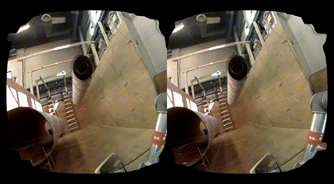

# rviz\_plugin\_osvr
## Introduction
Creates the [OSVR](http://www.osvr.com) stereo display for RViz. It wraps the IMU orientation and the headset position (tracked from IR camera) to control the view of the display. The rendered 3D context is provided by RVIz.


*This plugin is inspired by [oculus\_rvis\_plugins](https://github.com/ros-visualization/oculus_rviz_plugins) package.* 
 


## Build Instructions
### Setting up OSVR
This project uses the following OSVR components: [OSVR-Core](https://github.com/OSVR/OSVR-Core) and [libfunctionality](https://github.com/OSVR/libfunctionality). However, before trying to compile those, make sure your system meets the required [dependencies](https://github.com/OSVR/OSVR-Docs/blob/master/Getting-Started/Installing/Linux-Build-Instructions.md).
```
sudo apt update && sudo apt upgrade
sudo apt install libsdl2-dev libboost1.58-dev libboost-thread1.58-dev libboost-program-options1.58-dev libboost-filesystem-dev libusb-1.0-0-dev ros-kinetic-libuvc-ros
```

The build and install directories in this example are **~/build** and **~/osvr**, respectively. Feel free to modify them according to your needs.

#### libfunctionality & libuvc
```
# Create a directory for build files
mkdir ~/build && cd ~/build

# Clone the source files
git clone --recursive https://github.com/OSVR/libfunctionality.git
git clone https://github.com/ktossell/libuvc.git

# Build libfunctionality
cd libfunctionality
cmake . -DCMAKE_INSTALL_PREFIX=~/osvr
make
make install

# Build libuvc
cd ~/build/libuvc
mkdir build
cd build
cmake ..
make && sudo make install
```


#### OSVR-Core
Now that we have libfunctionality installed, clone yourself the source of OSVR-Core.

```
cd ~/build
git clone --recursive https://github.com/OSVR/OSVR-Core.git
```


The OpenCV3 in ROS-kinetic comes with .cmake files, which are responsible setting up include directories, library paths and all other variables for the build environment. In cmake, projects can be set-up using configurations (such as Release, Debug, etc.). OpenCV defines only one configuration called **NULL**, while osvr uses cmake's default configuration called **RelWithDebInfo**. Hence, running cmake with the default build type will cause opencv to not find its libraries and fails with `*** No rule to make target 'opencv_core-NOTFOUND' ***`.
The solution is remapping **RelWithDebInfo** configuration to **NONE** for each OpenCV module. We also have to specify the opencv modules and include directories, since some test components were unable to find OpenCV headers.  
So, locate the **~/build/OSVR-Core/CMakeLists.txt** and make the following changes:

```
...

-   find_package(OpenCV)
+   set(OpenCV_DIR "/opt/ros/kinetic/share/OpenCV-3.3.1/")
+   find_package(OpenCV COMPONENTS core videoio imgproc features2d calib3d highgui flann ml imgcodecs)

...

    if(BUILD_VIDEOTRACKER_PLUGIN)
        set(VIDEOTRACKER_EXTRA_LIBS
            opencv_imgproc
            opencv_features2d
+           opencv_ml
+           opencv_imgcodecs
            opencv_calib3d
            opencv_highgui
            opencv_imgproc
            opencv_flann) # flann is a transitive dependency

...

    if(OPENCV_MODULES_USED)
        list(REMOVE_DUPLICATES OPENCV_MODULES_USED)
+       # Set configuration mapping from RelWithDebInfo to NONE for each imported opencv module
+       foreach(_cvMod ${OPENCV_MODULES_USED})
+           message(STATUS "Adding mapping to component: ${_cvMod}")
+           set_property(TARGET ${_cvMod} APPEND PROPERTY MAP_IMPORTED_CONFIG_RELWITHDEBINFO NONE)
+       endforeach()
+       include_directories("${OpenCV_INCLUDE_DIRS}")
    endif()
...
```

Now we're ready to build OSVR with OpenCV. Remember to build it out of source using custom install prefix. You can make compiling faster with "make -j4" (or any other integer) on a multi-core system.

```
#Build OSVR-core
mkdir ~/build/OSVR-Core/build
cd ~/build/OSVR-Core/build
cmake .. -DCMAKE_INSTALL_PREFIX=~/osvr
make
make install
```

Before running the server, make sure you set the following udev rules (e.g. in `/etc/udev/rules.d/50-OSVR.rules`) or you have to start the server in privileged mode (see [OSVR-Core issue #330](https://github.com/OSVR/OSVR-Core/issues/330) for more details)
```
SUBSYSTEM=="usb", ATTR{idVendor}=="1532", ATTR{idProduct}=="0b00", MODE="0666", GROUP="plugdev" # osvr sensors
SUBSYSTEM=="usb", ATTR{idVendor}=="0572", ATTR{idProduct}=="1806", MODE="0666", GROUP="plugdev" # osvr audio
SUBSYSTEM=="usb", ATTR{idVendor}=="0bda", ATTR{idProduct}=="57e8", MODE="0666", GROUP="plugdev" # tracker camera for uvc-camera
```
Reload the rules. `sudo udevadm control --reload-rules && sudo udevadm trigger`

And we're good to roll.
Let's fire up the server with default config for HDK2 headset.  
`~/osvr/bin/osvr_server ~/osvr/share/osvrcore/osvr_server_config.json`

Open another terminal and verify that OSVR is working.  
`~/osvr/bin/OpenGLSample`

### Setting up rviz\_plugin\_osvr package
Clone the package into your catkin workspace, build as any other ROS package.
```
git clone https://github.com/Veix123/rviz-plugin-osvr.git
catkin build
```

Set the `OSVR_CORE`environmental variable to point to your OSVR install directory.
```
nano ~/.bashrc
export OSVR_CORE=~/osvr
```


## USAGE
The plugin needs a running **osvr_server**, which you can either add to a system start-up or run via launch scripts:  
`roslaunch rviz_plugin_osvr rviz_plugin_osvr.launch`  
Open up RViz, load the osvr display plugin, and have fun!

## Troubleshooting
* Could not open device ...

`sudo nano /etc/udev/rules.d/50-OSVR.rules`

Make sure the 'group' includes your current user. Then reboot to reload the udev rules.

## References
More information about this package is available in the paper [Improved Situational Awareness in ROS Using Panospheric Vision and Virtual Reality](https://doi.org/10.1109/HSI.2018.8431062).
If you are using this software please add the following citation to your publication:
```
@INPROCEEDINGS{VunderSA2018, 
author={V. Vunder and R. Valner and C. McMahon and K. Kruusamäe and M. Pryor}, 
booktitle={2018 11th International Conference on Human System Interaction (HSI)}, 
title={Improved Situational Awareness in ROS Using Panospheric Vision and Virtual Reality}, 
year={2018}, 
pages={471-477}, 
keywords={Robots;Data visualization;Cameras;Headphones;Lenses;Distortion;Rendering (computer graphics);situational awareness;human-robot interaction;virtual reality;user interfaces;panospheric vision;telerobotics;ROS;RViz}, 
doi={10.1109/HSI.2018.8431062}, 
month={July},}
```

